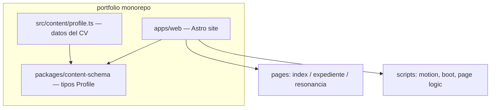

# Portafolio — Juan Pablo Ausensi

Sitio personal con dos experiencias: **Expediente** para leer el CV con scroll animado, y **Resonancia** para explorarlo como un mini-juego de sintonía con audio reactivo.

**En vivo:** [jotak1.github.io/portfolio](https://jotak1.github.io/portfolio/)

## Características

| Vista | Ruta | Qué hace |
|---|---|---|
| **Launcher** | `/portfolio/` | Canvas halftone interactivo y elección entre las dos vistas |
| **Expediente** | `/portfolio/expediente/` | CV scrollable con GSAP ScrollTrigger, barra de progreso y secciones de trayectoria, stack y contacto |
| **Resonancia** | `/portfolio/resonancia/` | Mini-juego de sintonía de señales con Web Audio, ondas SVG y contenido del CV como "señales" |

Las transiciones entre páginas usan la **View Transitions API** (MPA). Resonancia genera audio en tiempo real según la frecuencia de cada señal. La lógica compartida vive en `apps/web/src/scripts/motion.js`.

## Stack técnico

- **Runtime / build:** Bun workspaces, Astro 5
- **Animación:** GSAP + ScrollTrigger
- **Audio:** Web Audio API (Resonancia)
- **Tipos:** TypeScript, paquete compartido `@portfolio/content-schema`
- **Deploy:** GitHub Pages (`base: '/portfolio/'`)

## Requisitos

- [Bun](https://bun.sh) ≥ 1.1
- Node ≥ 22.12
## Desarrollo local

```bash
bun install
bun run dev
```

Abre `http://localhost:4321/portfolio/` — el `base` en `apps/web/astro.config.mjs` apunta a GitHub Pages.

## Scripts

```bash
bun run dev        # Astro dev server
bun run build      # salida en apps/web/dist
bun run preview    # preview del build
bun run check      # astro check (tipos)
bun run deploy     # build + gh-pages → rama gh-pages (manual)
```

## Arquitectura

Monorepo con la app Astro y un paquete de tipos compartidos:

```
portfolio/
├── apps/web/
│   ├── src/pages/              # index, expediente, resonancia
│   ├── src/scripts/            # motion.js, boot.ts, *-page.js
│   ├── src/styles/pages/       # CSS por vista
│   ├── src/content/profile.ts  # fuente de verdad del CV
│   └── astro.config.mjs        # base /portfolio/ para GitHub Pages
├── packages/content-schema/    # tipos Profile, Experience, SignalId
└── .github/workflows/deploy.yml
```

Flujo de datos:



## Editar contenido

Para actualizar bio, experiencia, stack o contacto, edita [`apps/web/src/content/profile.ts`](apps/web/src/content/profile.ts). Los tipos están en [`packages/content-schema/src/index.ts`](packages/content-schema/src/index.ts).

**Nota:** Resonancia duplica parte del copy en [`apps/web/src/scripts/resonancia-page.js`](apps/web/src/scripts/resonancia-page.js). Si cambias contenido del CV, revisa ambos archivos.

## Deploy

### Automático (recomendado)

Cada push a `main` dispara [`.github/workflows/deploy.yml`](.github/workflows/deploy.yml):

1. `bun install --frozen-lockfile`
2. `bun run build`
3. Publica `apps/web/dist` a la rama `gh-pages` (`peaceiris/actions-gh-pages`, `enable_jekyll: false`)

### Manual (fallback)

```bash
bun run deploy
```

Publica `apps/web/dist` a `gh-pages` usando la CLI `gh-pages`.

### Historia

El CRA antiguo vive en la rama `legacy-cra`. En `main` corre Astro con `base: '/portfolio/'`.

## Origen del diseño

Prototipado en Open Design (Expediente + Resonancia + GSAP) y montado en Astro para desplegar en el mismo GitHub Pages. El HTML/CSS/JS de las vistas conserva los atributos `data-od-id` del prototipo original.
